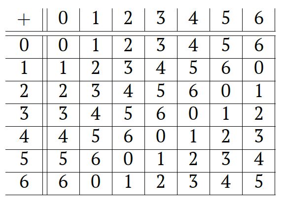
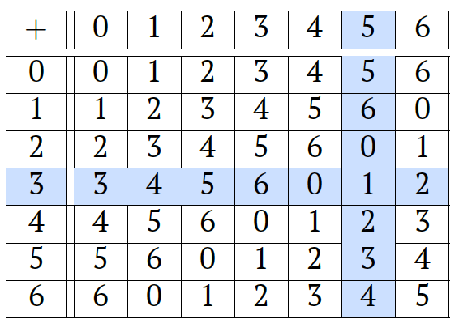
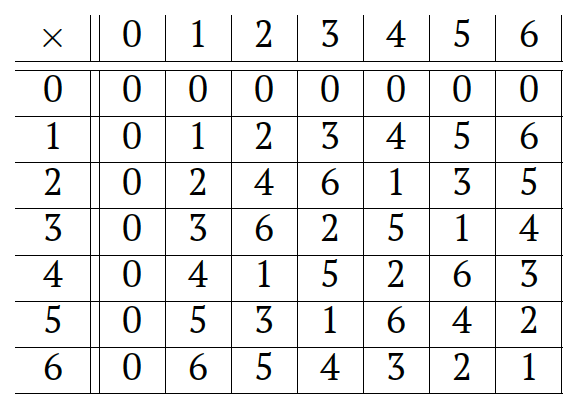
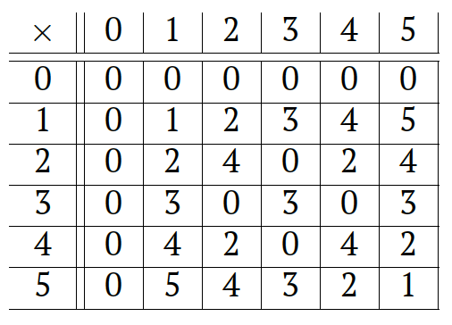

## Modular Subtraction and Division
We have seen that any number is congruent to its remainder modulo $m$ and arithmetic operations preserve congruence. In particular, we can substitute all numbers by their remainders in arithmetic expressions if we are interested only in computations modulo $m$. Note, that we can do the same substitution by the remainder after each step of the calculation. This allows us to reduce all arithmetic operations to just remainders and to create arithmetic operations tables.

Consider $m=7$ and consider addition operation $a + b \mod{7}$, where $a$ and $b$ are two remainders modulo $7$. We get the following table:

Here, the entry on the intersection of a row $a$ and a column $b$ contains $a + b \mod{7}$. For example, the entry on the intersection of the row $a=3$ and the column corresponds to $b=5$ contains $1$, which is the remainder of $a + b = 8$ when divided by $7$:

We can create a similar table for the multiplication:

Here, the entry on the intersection of row $a$ and a column $b$ contains $a \times b \mod{7}$. For example, that the first row and the first column consist of zeros. This is not surprising, each entry there contains some number multiplied by $0$.

We can use these tables to perform modular calculations. Given an arithmetic expression, we can substitute all numbers by their remainders and then perform arithmetic operations one by one using the tables.  

Tables are also convenient to study the properties of the operations.

__Problem.__ Suppose we have two numbers $a$ and $b$. Is there $x$ such that $a + x \equiv b \mod{7}$? 

To check this we can use the table for the addition above. Here, $a$ corresponds to the row of the table, $x$ correspond to the column and $b$ corresponds to the entry on the intersection. From the table we can see that the answer to the question is positive: each row contains all possible remainders.

Once we notice this property, we can ask whether it is true for any $m$.

__Problem.__ Let $a$, $b$ and $m>1$ be integers. Is there $x$ such that $a + x \equiv b \mod{m}$? 

It turns out that the answer is positive even for an arbitrary $m$. To see this, consider $b-a$ as an integer and consider its remainder $x$ modulo $m$. We know that $a + (b - a) \equiv b \mod{m}$ and the congruence remains true even if we substitute $b-a$ by its remainder.

The number $x$ in this problem plays a role of _modular subtraction_ $b-a$ in modular arithmetic. Thus, we have just checked that the subtraction is always possible in modular arithmetic.

__Problem.__ Suppose we have a number $a$ not divisible by $7$ and a number $b$. Is there an integer $x$ such that $a \cdot x \equiv b \mod{7}$? 

In this problem we can use the table for multiplication above. Again, $a$ corresponds to the row of the table (but since $a$ is not divisible by $7$, we consider only the rows starting from the second one), $x$ correspond to the column and $b$ corresponds to the entry on the intersection. From the table we can see that the answer to the question is positive again: each row starting from the second one contains all possible remainders.

Here, $x$ plays the role of _modular division_ $b/a$: it is the number such that if we multiply it by $a$, we get $b$. We have just observed that division is always possible for $m = 7$ apart from an obvious case of division by $a \equiv 0 \mod{7}$. It might seem that we are now just one step away from answering our original question of establishing all arithmetic operations in modular arithmetic. But let us consider one more example. 

__Problem.__ Suppose we have a number $a$ not divisible by $6$ and a number $b$. Is there an integer $x$ such that $a \cdot x \equiv b \mod{6}$? 

To answer this question, we first need a table for multiplication modulo $m=6$. It is not hard to write one down:

Now the situation changed: rows corresponding to $a=2$, $3$, and $4$ do not contain all possible remainders. For example, there is no $x$ such that $3x \equiv 1 \mod{6}$.

Thus, it turns out that division modulo $6$ is not always possible. Now a lot of questions arise. Why is division modulo $7$ always possible, but it is not always possible modulo $6$? Is there a way when the division is possible and when it is not? We will figure this out soon!

### Summary.
- In this chapter, we started with simple notions, like divisibility and remainders, and from that we have developed the basics of modular arithmetic.
- But we do not understand the things completely: we arrived into a problem with modular division.
- The things turn out to be rather complicated. On the one hand, it is bad: it is nice when the computations and calculations are simple. On the other hand, this is good: complicated things are crucial for cryptography.
    
