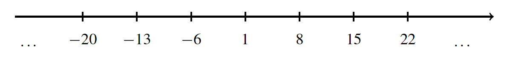

## Remainders
We have seen that the division over integers is not always possible. But we can generalize it. 

__Definition (Division with remainder).__ Let $a$ be an integer and $b$ be a positive integer. The result of the division of $a$ by $b$ with a remainder is a pair of integers, $q$ called quotient and $r$ called remainder, such that 

$a = qb + r$

and $0 \leq r < b$.

Observe, that if $r = 0$, then $a$ is divisible by $b$.

The intuition behind this definition is simple. Assume that $a$ is positive. We would like to split $a$ objects into groups of size $b$. We form the groups one by one. In the end it might happen that there are some objects left and there are not enough of them for the new group. The number of the remaining objects is the remainder $r$ and the number of completed groups is the quotient $q$. 

Let us consider several examples.

* For $a = 15$ and $b = 4$, we have $15 = 3 \cdot 4 + 3$. Here $q = r = 3$.
* For $a = -13$ and $b = 3$, we have $-13 = (-5) \cdot 3 + 2$ and $q = -5$, $r = 2$.
* For $a = 12$ and $b = 4$, we have $12 = 3 \cdot 4 + 0$ and $q = 3$, $r = 0$.

In Python, one can compute the quotient and the remainder either directly or using a built-in method `divmod`.

```python
a, b = -13, 3
print(a // b, a % b)
print(divmod(a, b))
```

```python
-5 2
(-5, 2)
```

To further develop our intuition, let us address the following question. How do numbers that give remainder $1$ when divided by $7$ look like? These numbers have the form 

$a = 7q + 1$

where $q$ is any integer. For example, for $q = 0$ we have $a = 1$. For positive $q = 1, 2, 3, ...$, we get the sequence $a = 8, 15, 22, ...$. For negative $q = -1, -2, -3, ...$, we get the sequence $a = -6, -13, -20, ...$. Overall, we get the following picture.



We can observe that the distance between any two consecutive numbers is exactly 7 and thus, every 7-th number has the same remainder when divided by 7. Clearly, this analysis generalize to division by any number $b$ and any remainder $r$: each $b$-th number has the remainder $r$ when divided by $b$. 
